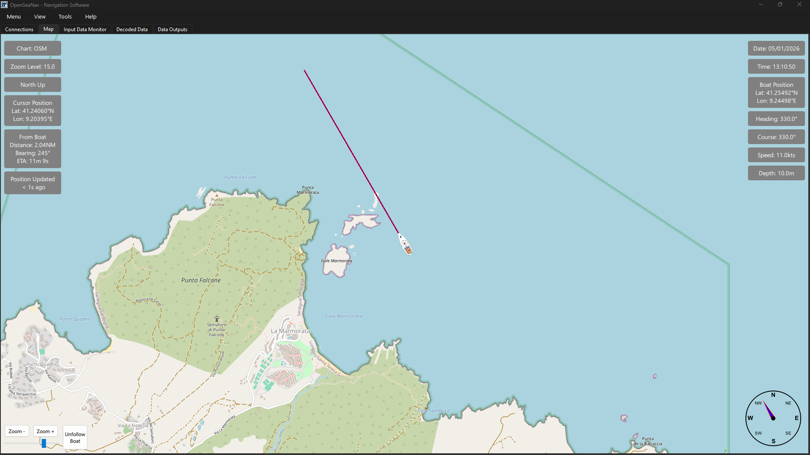

# OpenSeaNav — Monitoring & Forwarding Tool for NMEA0183

## Features 

**NMEA Device Connection**  
Connect any NMEA0183 compatible device via serial or UDP.

**NMEA Monitoring**  
Display both raw and decoded NMEA sentences (GGA, RMC, GSV, etc.) in real-time.

**Map Display**  
Integrated OpenStreetMap panel showing the real-time boat position and NMEA-derived data (e.g., speed, heading, etc).

**Data Forwarding**  
Forward received NMEA data to UDP and/or secondary serial ports
     
**Selective Output Control**  
Filter sentence types (e.g. output only GGA or RMC) on each output.

**Data Logging**  
Record data to a local file in multiple formats (txt, csv, nmea, log)

## Copyright and licensing

This software is Copyright (c) Kupofty 2025.  
This project is licensed under the Apache 2.0 License.  
You are free to use, modify, and distribute this software, provided you include proper attribution and comply with the terms of the license.  
See the LICENSE file for more details.  