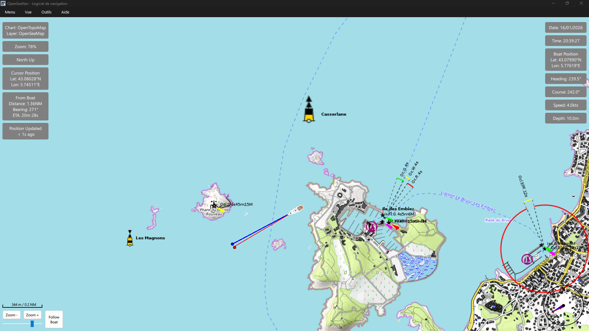
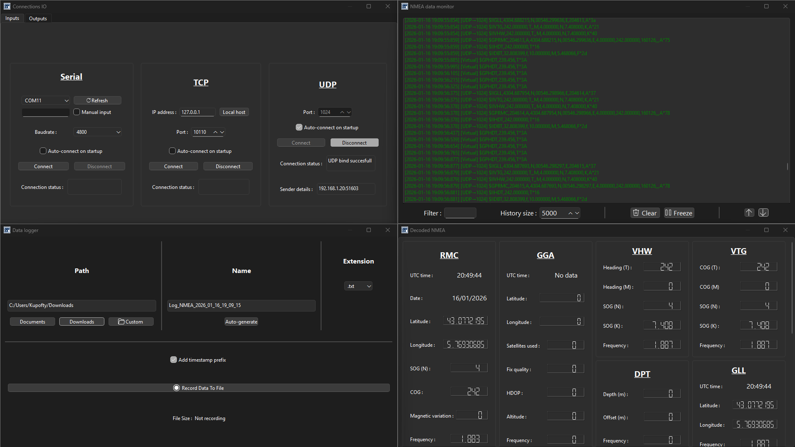

# OpenSeaNav — Real-Time NMEA0183 Monitoring & Forwarding Tool

## Overview

OpenSeaNav is a versatile tool for marine navigation and monitoring, designed for NMEA0183-compatible devices. 
It enables real-time display, logging, and forwarding of navigation data with integrated map visualization, using free and open-source charts.

## Features

### NMEA Device Connection
- Connect any NMEA0183-compatible device via Serial, TCP, or UDP.  
- Supports multiple simultaneous device connections.

### NMEA Monitoring
- Display both raw NMEA sentences and decoded data in real-time.  
- Supports standard sentences including GGA, RMC, GSV, and more.  
- Live updates of position, heading, speed, and other navigation metrics.

### Map Display
- Integrated OpenStreetMap panel shows live boat position.  
- Tracks routes, heading, and course over ground.  
- Overlay options include OpenSeaMap nautical charts.  

### Data Forwarding
- Forward received NMEA data to UDP and/or secondary serial ports.  
- Supports multiple targets and protocols simultaneously.

### Selective Output Control
- Filter sentence types per output stream.  
- Forward only selected sentences (e.g., GGA, RMC) to different outputs.

### Data Logging
- Record received data in multiple formats: TXT, CSV, NMEA, LOG.  
- Timestamped logs for historical review and analysis.  

### User Interface
- Live dashboards and widgets for quick overview of navigation data.  
- Configurable panels for both map and raw/decoded data views.  

## Screenshots

Map & Navigation View  

Data Monitoring & Widgets  

## Project Status
OpenSeaNav is a non-commercial personal project created for learning purposes and to support the marine and open-source community. Many improvements and new features are expected as the project evolves.

## Supported Platforms
- Windows 10/11
- Linux
- macOS (not tested)

## Configuration Overview
- Input: Serial / TCP / UDP
- Output: Serial / UDP / Logs
- Map & Layer: Internet connection or cached tiles

## Data Sources & Attribution
- OpenStreetMap (www.openstreetmap.org)
- OpenSeaMap (www.openseamap.org)

## Contributing
- Contributions are welcome via Pull Requests.
- Report bugs and feature requests in the GitHub Issues section.
- Use the GitHub Discussions section for questions, ideas, and general discussion.

## Disclaimer
This software is not certified for navigation.  
Charts and data are provided for informational purposes only and must not be relied upon as a primary means of navigation.

## Licence
This project is licensed under the Apache License 2.0   
© Kupofty 2025.

You are free to use, modify, and distribute the software, provided proper attribution is included and the license terms are followed. 
See the LICENSE file for full details.
